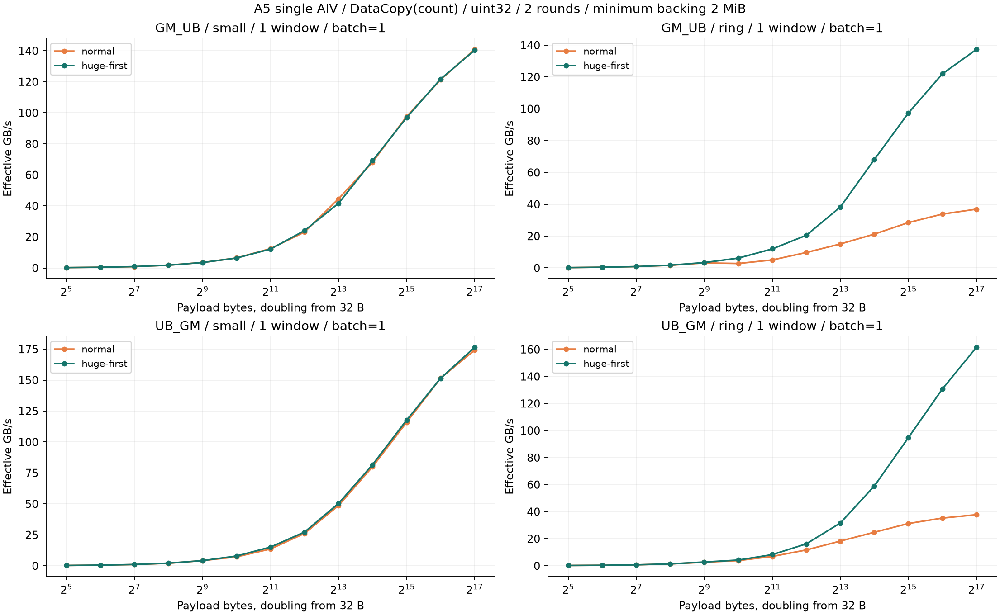
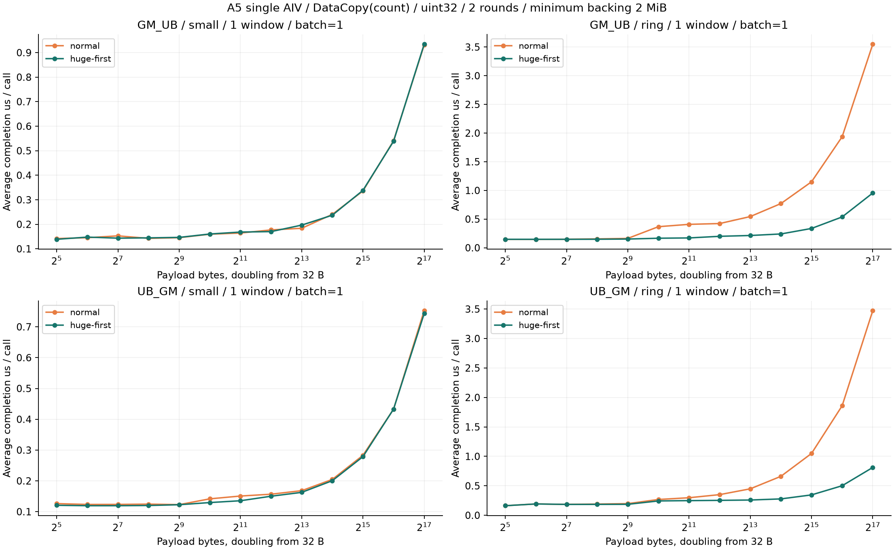
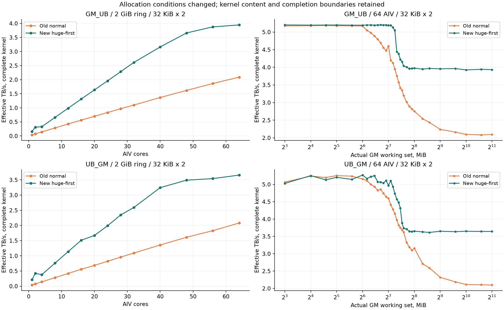

# A5 DataCopy：大页条件下重测单核、对齐与多核

单核对照确认：页策略的影响随工作集变化。固定 128 KiB payload、64 MiB ring、单窗口、batch=1，普通页 → 大页优先，GM_UB 为 36.936 → 137.289 GB/s（3.717×）；UB_GM 为 37.745 → 161.520 GB/s（4.279×）。这仍是含循环与完成等待的有效 API 吞吐，未测物理 HBM 事务。小工作集的配对单独列出，不能套用大 ring 的加速比。

2026-10-10 / Ascend950DT_9582 / CANN 9.1.0，实际查询到 64 AIV、221184 B UB。完成 7,166 个配置轮次、85,992 个正式计时样本，全部两轮覆盖、原始归档、输出校验与计时一致性通过接收端验收。旧数据独立保留。

[交互曲线、参数、单轮样本与实测代码](https://kirrito-k423.github.io/micro-benchmark-lab-web/?lab=page-retest)

## 单 AIV 从 32 B 起步

payload 为一次 API 搬运的有效字节；32、64、128 B……逐次翻倍。count / params、batch=1、单窗口有 13 个大小，至 128 KiB。三个重载、两个方向、1/2 窗口、batch=1/8、小工作集 / ring 分开扫描，受 UB 与 API 字段约束裁剪。108 个非法组合记录为 skipped，不当作慢样本。

普通页与大页优先的新配对使用同一 CANN、kernel、shape、loops、slots 和输入模式，两个轮次分别打乱顺序，每个配置重新申请数据。2 次预热、12 次正式 trace，另有 12 次关闭 trace 的正确性启动。输入与输出数据 GM 至少申请 2 MiB，其余记录/参数使用普通页。申请容量不等于实际访问工作集。





以下表固定 uint32、DataCopy(count)、单窗口、batch=1。p50 先按每轮 12 个样本计算，再取两轮 p50 中位数；吞吐以同一个汇总 p50 计算。速度比为普通页耗时 / 大页优先耗时，不用独立 best 值。

### GM_UB / small

| payload | 实际 GM 工作集 | loops | 普通页 μs / call | 大页优先 μs / call | 普通页 GB/s | 大页优先 GB/s | 速度比 |
| --- | --- | --- | --- | --- | --- | --- | --- |
| 32 B | 32 B | 8192 | 0.14187 | 0.13876 | 0.226 | 0.231 | 1.022× |
| 64 B | 64 B | 8192 | 0.14527 | 0.14774 | 0.441 | 0.433 | 0.983× |
| 128 B | 128 B | 8192 | 0.15278 | 0.14339 | 0.838 | 0.893 | 1.066× |
| 256 B | 256 B | 8192 | 0.14253 | 0.14464 | 1.796 | 1.770 | 0.985× |
| 512 B | 512 B | 8192 | 0.14538 | 0.14652 | 3.522 | 3.494 | 0.992× |
| 1 KiB | 1 KiB | 8192 | 0.15957 | 0.16042 | 6.417 | 6.383 | 0.995× |
| 2 KiB | 2 KiB | 8192 | 0.16425 | 0.16833 | 12.469 | 12.167 | 0.976× |
| 4 KiB | 4 KiB | 4096 | 0.17712 | 0.17017 | 23.126 | 24.070 | 1.041× |
| 8 KiB | 8 KiB | 2048 | 0.18368 | 0.19662 | 44.600 | 41.664 | 0.934× |
| 16 KiB | 16 KiB | 1024 | 0.24027 | 0.23703 | 68.191 | 69.123 | 1.014× |
| 32 KiB | 32 KiB | 512 | 0.33582 | 0.33824 | 97.576 | 96.877 | 0.993× |
| 64 KiB | 64 KiB | 256 | 0.54026 | 0.53829 | 121.305 | 121.748 | 1.004× |
| 128 KiB | 128 KiB | 256 | 0.93075 | 0.93419 | 140.824 | 140.305 | 0.996× |

### GM_UB / ring

| payload | 实际 GM 工作集 | loops | 普通页 μs / call | 大页优先 μs / call | 普通页 GB/s | 大页优先 GB/s | 速度比 |
| --- | --- | --- | --- | --- | --- | --- | --- |
| 32 B | 2 MiB | 65536 | 0.14744 | 0.14743 | 0.217 | 0.217 | 1.000× |
| 64 B | 4 MiB | 65536 | 0.14745 | 0.14741 | 0.434 | 0.434 | 1.000× |
| 128 B | 8 MiB | 65536 | 0.14883 | 0.14741 | 0.860 | 0.868 | 1.010× |
| 256 B | 16 MiB | 65536 | 0.15431 | 0.14859 | 1.659 | 1.723 | 1.038× |
| 512 B | 32 MiB | 65536 | 0.16313 | 0.15188 | 3.139 | 3.371 | 1.074× |
| 1 KiB | 64 MiB | 65536 | 0.36748 | 0.16617 | 2.787 | 6.162 | 2.212× |
| 2 KiB | 64 MiB | 32768 | 0.40826 | 0.17140 | 5.016 | 11.949 | 2.382× |
| 4 KiB | 64 MiB | 16384 | 0.42210 | 0.19957 | 9.704 | 20.524 | 2.115× |
| 8 KiB | 64 MiB | 8192 | 0.54415 | 0.21388 | 15.055 | 38.301 | 2.544× |
| 16 KiB | 64 MiB | 4096 | 0.77041 | 0.24051 | 21.267 | 68.123 | 3.203× |
| 32 KiB | 64 MiB | 2048 | 1.15014 | 0.33668 | 28.490 | 97.326 | 3.416× |
| 64 KiB | 64 MiB | 1024 | 1.93570 | 0.53738 | 33.856 | 121.956 | 3.602× |
| 128 KiB | 64 MiB | 512 | 3.54865 | 0.95472 | 36.936 | 137.289 | 3.717× |

### UB_GM / small

| payload | 实际 GM 工作集 | loops | 普通页 μs / call | 大页优先 μs / call | 普通页 GB/s | 大页优先 GB/s | 速度比 |
| --- | --- | --- | --- | --- | --- | --- | --- |
| 32 B | 32 B | 8192 | 0.12628 | 0.12079 | 0.253 | 0.265 | 1.045× |
| 64 B | 64 B | 8192 | 0.12352 | 0.11941 | 0.518 | 0.536 | 1.034× |
| 128 B | 128 B | 8192 | 0.12363 | 0.11942 | 1.035 | 1.072 | 1.035× |
| 256 B | 256 B | 8192 | 0.12460 | 0.12010 | 2.055 | 2.132 | 1.037× |
| 512 B | 512 B | 8192 | 0.12290 | 0.12260 | 4.166 | 4.176 | 1.002× |
| 1 KiB | 1 KiB | 8192 | 0.14173 | 0.12964 | 7.225 | 7.899 | 1.093× |
| 2 KiB | 2 KiB | 8192 | 0.15082 | 0.13553 | 13.579 | 15.111 | 1.113× |
| 4 KiB | 4 KiB | 4096 | 0.15675 | 0.15021 | 26.131 | 27.268 | 1.044× |
| 8 KiB | 8 KiB | 2048 | 0.16825 | 0.16271 | 48.690 | 50.347 | 1.034× |
| 16 KiB | 16 KiB | 1024 | 0.20477 | 0.20056 | 80.010 | 81.690 | 1.021× |
| 32 KiB | 32 KiB | 512 | 0.28290 | 0.27853 | 115.829 | 117.644 | 1.016× |
| 64 KiB | 64 KiB | 256 | 0.43256 | 0.43287 | 151.506 | 151.400 | 0.999× |
| 128 KiB | 128 KiB | 256 | 0.75257 | 0.74292 | 174.166 | 176.429 | 1.013× |

### UB_GM / ring

| payload | 实际 GM 工作集 | loops | 普通页 μs / call | 大页优先 μs / call | 普通页 GB/s | 大页优先 GB/s | 速度比 |
| --- | --- | --- | --- | --- | --- | --- | --- |
| 32 B | 2 MiB | 65536 | 0.16241 | 0.16241 | 0.197 | 0.197 | 1.000× |
| 64 B | 4 MiB | 65536 | 0.19242 | 0.19231 | 0.333 | 0.333 | 1.001× |
| 128 B | 8 MiB | 65536 | 0.18516 | 0.18433 | 0.691 | 0.694 | 1.004× |
| 256 B | 16 MiB | 65536 | 0.19060 | 0.18494 | 1.343 | 1.384 | 1.031× |
| 512 B | 32 MiB | 65536 | 0.19782 | 0.18614 | 2.588 | 2.751 | 1.063× |
| 1 KiB | 64 MiB | 65536 | 0.26810 | 0.24339 | 3.820 | 4.207 | 1.102× |
| 2 KiB | 64 MiB | 32768 | 0.29789 | 0.24878 | 6.875 | 8.232 | 1.197× |
| 4 KiB | 64 MiB | 16384 | 0.35048 | 0.25308 | 11.687 | 16.185 | 1.385× |
| 8 KiB | 64 MiB | 8192 | 0.44907 | 0.25903 | 18.242 | 31.625 | 1.734× |
| 16 KiB | 64 MiB | 4096 | 0.66111 | 0.27785 | 24.783 | 58.966 | 2.379× |
| 32 KiB | 64 MiB | 2048 | 1.04909 | 0.34595 | 31.235 | 94.719 | 3.032× |
| 64 KiB | 64 MiB | 1024 | 1.85853 | 0.50130 | 35.262 | 130.732 | 3.707× |
| 128 KiB | 64 MiB | 512 | 3.47256 | 0.81149 | 37.745 | 161.520 | 4.279× |

small 会重复访问同一小工作集，ring 按 slots 遍历。ABI 最多 65,536 slots：32 B ring 实际 2 MiB、64 B 为 4 MiB，逐渐到 64 MiB。缓存策略为 API 默认，未测缓存命中，不能把这些 ring 点称为冷 HBM；小请求曲线也不能证明物理带宽峰值。

## 复测覆盖与波动

| 实验 | 配置轮次 | 正式样本 | 两轮 p50 相对差异中位数 |
| --- | --- | --- | --- |
| 单 AIV，32 B 倍增与页策略配对 | 2,064 | 24,768 | 0.035% |
| 旧单核容量配置 | 944 | 11,328 | 0.005% |
| 长度与地址对齐 | 2,992 | 35,904 | 0.011% |
| 固定分配边界对照 | 120 | 1,440 | 0.007% |
| 多核带宽 | 756 | 9,072 | 0.035% |
| 工作集加密扫描 | 210 | 2,520 | 0.085% |
| 纯写窗口等待 / 末尾等待 | 80 | 960 | 0.063% |

每个短任务开始和结束各检查整台 Host / 容器的 NPU 进程。占用快照没有其他 NPU 进程；两次快照之间的瞬时干扰未知。所有 12 个正式样本保留，包括慢样本。小幅差异需要结合两轮波动看，不将单个最优样本当成能力上限。

## 多核、工作集与纯写



多核横轴是共同 kernel 使用的 AIV 数，使用完整同 stream ACL Event；窗口等待、核间同步、初始化及结果导出仍在该计时内。有效搬运字节除以共同时间，不相加各核独立峰值。旧曲线与新曲线使用同一 kernel 文件内容，Host 的输入/输出分配都从普通页改为大页优先。分配容量与新得到的物理页布局还可能变化，因此该旧/新比较是完整分配条件的复验。

| 方向 / 分区读写 | 2 GiB 工作集、32 KiB × 2、64 AIV：旧普通页 TB/s | 新大页优先 TB/s | 达到本扫描峰值 95% 的最少 AIV | 本扫描峰值 TB/s |
| --- | --- | --- | --- | --- |
| GM_UB | 2.090 | 3.946 | 56 | 3.946 |
| UB_GM | 2.081 | 3.659 | 48 | 3.659 |

95% 只指当前离散扫描的观测峰值，不能叫作芯片理论带宽的 95%。同址读的有效字节包含各核反复读取同一数据，另列为 shared_read；不能直接与分区遍历的 HBM 流量比较。

工作集曲线仍固定 64 AIV、32 KiB × 2；128 MiB 附近按原扫描加密。大页复测没有将两端压成一个“5 → 2 TB/s”结论：图中保留每个大小及旧/新条件。写实验保留全部目标与保护区 oracle。

| 纯写 / 64 AIV / 1 GiB | Windowed TB/s | Tail TB/s | Tail 相对速度 |
| --- | --- | --- | --- |
| 4 KiB × 1 | 2.099 | 3.615 | 1.723× |
| 4 KiB × 8 | 3.652 | 3.604 | 0.987× |
| 32 KiB × 2 | 3.665 | 3.644 | 0.994× |
| 64 KiB × 1 | 3.637 | 3.607 | 0.992× |

Tail 与 Windowed 在一个配置中共用分配，每次预热和计时随机先后。Tail 只将循环中的每窗 MTE3→Scalar 等待移到末尾，UB 数据保持不变；仍等待写入完成再结束核计时，并保留完整 ACL Event，不把异步提交时间当成完成时间。

## 页策略、同步与归因边界

- NORMAL_ONLY 固定普通页；HUGE_FIRST 优先大页但可以回退。HUGE_ONLY 的 32 B / 128 KiB / 非对齐冒烟通过，只证明那些申请成功，不能证明所有正式 HUGE_FIRST 申请都未回退。见 [CANN 9.1 分配策略](https://www.hiascend.com/doc_center/source/en/CANNCommunityEdition/910/API/runtimeapi/aclpythondevg_01_0962.html)。
- 页策略改变可以影响翻译覆盖和物理地址布局；本轮没有测 TLB miss、实际页表、bank / 通道映射或物理 HBM 事务，不能确定唯一硬件机制。核间逻辑地址不重叠也不排除共享内存资源冲突。
- 旧单核容量 A5 用 CANN 9.2.0，本轮为 9.1.0，且小请求有新的申请容量下限。旧容量 / 新容量不是仅切换页策略的因果对照。新的 power2 普通页 / 大页配对才是同版本、同几何参数比较。
- 单 AIV 使用 trace.Mark(2)→trace.Mark(3)，包含提交、地址计算、完成等待和排空，除以 loops × batch；初始化和导出在区间外。双窗口平均完成成本不是独立请求的尾延迟。每组 WindowEvent 等待保证目标窗口可安全复用，不能直接删掉。见 [CANN 9.1 核内同步](https://www.hiascend.com/document/detail/en/CANNCommunityEdition/910/API/ascendcopapi/docs/en/api/SIMD-API/basic_api/sync_control/intra_core_sync/intra_core_synchronization_capability_overview.md)。
- 本轮是 A5 单设备本地 GM 的无其他进程快照条件；A3、跨设备/跨节点通信与真实 DeepEP 算子收益不从本轮推断。原 DataCopy、SIMD 和通信归档未覆盖。

## 复现与接收验收

[编译时的固定源码内容](https://github.com/Kirrito-k423/micro-benchmark-lab-web/tree/d5ba9f0/experiments/a5_page_retest) 保留原 kernel / oracle；native Host 增加分配策略参数和 2 MiB 申请下限，C++ Host 的输入/输出策略改为 HUGE_FIRST。网页逐点源代码面板绑定实测二进制与文件 SHA-256。编译后才提交源码的 Git commit 只是相同文件内容的索引，不冒充当时记录的全仓 commit。

计划脚本曾将空对照的有效搬运字节 0 当成目标工作量，C++ 参数检查在进入 kernel 前拒绝了该批。失败归档保留；从旧记录的 groups × cores × tile × batch 恢复 56 个控制配置轮次的原工作量，控制批次采用新 key（-control）与新输出目录。所有 payload 配置、已通过的单核/对齐配置、kernel 和二进制保持不变。接收器核对两个冻结计划的全部差异，只允许这项修正；源码归档仍绑定实际编译时内容。[当前复现脚本](https://github.com/Kirrito-k423/micro-benchmark-lab-web/tree/codex/a5-mbench-results/experiments/a5_page_retest) 已修复生成规则，可以完整再生修正后的参数矩阵。

先查实际芯片、AIV、UB 与匹配 CANN 的 SYS_CNT 频率，再生成计划。借用机器只在整台 Host 和容器无其他 NPU 进程时运行；短批次独立输出目录，未知结果只查询，不重放。

```bash
cd experiments/a5_page_retest
python3 plan.py --web-root /path/to/micro-benchmark-lab-web \
  --ub-bytes 221184 --aiv-count 64 --soc Ascend950DT_9582 \
  --clock-hz 1000000000 --clock-source 'CANN GetSystemCycle: Ascend950PR/950DT SYS_CNT 1 GHz' \
  --output execution-plan.json
source /usr/local/Ascend/cann/set_env.sh
bash build.sh
# 用全新目录执行一个短批；完整计划内所有 key 各执行一次。
python3 run_stage.py --device 1 --key power2-r1-normal-c000 \
  --plan execution-plan.json --output results/fresh-stage
```

接收器验证任务终态与退出码、原 tar SHA-256 与逐文件字节、四份占用记录、所有源码/二进制、精确参数和矩阵；native 重新 decode 每个原始 trace 并与样本 tick 比较，校验全部预热/trace/关闭 trace 的正确性；C++ 核对所有核记录、ACL 时间、字节覆盖与完整 oracle。核持续 ticks 不得超出完整 kernel / Host 时间。

```bash
uv run --no-project --with numpy python scripts/import-a5-page-retest.py \
  --runs /absolute/private/a5-page-retest-20261010 \
  --output public/data/a5-page-retest.json
uv run --no-project --with matplotlib python scripts/report-a5-page-retest.py \
  --data public/data/a5-page-retest.json \
  --report public/reports/a5-page-retest-20261010.md --figures public/figures
node scripts/check-measurement-code.mjs
```

`--partial` 仅本地检查，完整覆盖与正确性通过后才发布。公开 JSON 保留参数、12 个样本、持续 tick、页策略与哈希，完整日志、机器身份、地址、任务凭据及绝对时间留在私有 results。

计划 SHA-256：`dd3ac6b39d1a0fcdff635277bea90cd8af9a297c40403135b70a9445e1bd780c`；源码打包 SHA-256：`834c4743c3c7b22b44b58a761000f01f5af70f4fbfc9fb3c4a4eee7575d522a4`。
