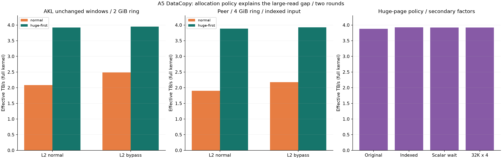

# A5 DataCopy：复现同事代码，约 2 TB/s 的差距来自哪里

同事原代码两轮中位数分别为 3.883、3.879 TB/s，复现超过 3.3 TB/s。AKL 固定原来的 2 GiB ring、32 KiB × 2、64 AIV、4 GiB 总搬运量和双窗口完成策略，仅改变输入 GM 分配，普通页 2.084 → 大页优先 3.921 TB/s，1.881 倍。

原基准固定 `ACL_MEM_MALLOC_NORMAL_ONLY`，测到的是普通页分配条件下的完成吞吐。网页过去没有突出这个条件，现在补充显式标注和独立对照入口。约 2 TB/s 不能代表 DataCopy 或当前芯片的能力上限。

2026-10-10，Ascend950DT_9582 / CANN 9.1.0，同一借用节点的同一设备，64 AIV。21 配置 × 两轮、840 正式样本、210 次预热；另有原代码冒烟 3 样本。每个配置 5 次预热、20 次计时，两个控制变量轮次各自随机顺序，每个配置新分配。



## 关键配对

| 实现与参数 | 普通页 TB/s | 大页优先 TB/s | 速度比 |
| --- | --- | --- | --- |
| AKL / 2 GiB ring / 32 KiB × 2 / 索引输入 / 双窗口 / L2 normal | 2.084 | 3.921 | 1.881× |
| AKL / 2 GiB ring / 32 KiB × 2 / 索引输入 / 双窗口 / L2 bypass | 2.486 | 3.948 | 1.588× |
| Peer / 4 GiB / 64 KiB × 2 / 索引输入 / MTE2 PipeBarrier / L2 normal | 1.902 | 3.888 | 2.044× |
| Peer / 4 GiB / 64 KiB × 2 / 索引输入 / MTE2 PipeBarrier / L2 bypass | 2.177 | 3.927 | 1.804× |

所有配对仅改变输入分配策略，sink / records 在各实现内保持原分配策略；没有改变芯片功耗、时钟、驱动或系统配置。这里的分配效果包含新分配得到的页与地址布局，不能把它解读为固定物理地址上的实验。

## 同步、输入和 tile 的影响

- 大页优先、索引输入、L2 normal：PipeBarrier 3.888，每组 MTE2→Scalar 完成等待 3.894 TB/s，速度比 1.001×。这只是该 64 KiB × 2 大块读取场景，不推导小请求的同步开销。
- 大页优先、索引输入、L2 bypass：PipeBarrier 3.927，每组 MTE2→Scalar 完成等待 3.921 TB/s，速度比 0.998×。这只是该 64 KiB × 2 大块读取场景，不推导小请求的同步开销。
- 同一 Peer 路径：tile 内相同值 3.872，AKL 索引输入 3.927 TB/s。输入值模式不足以解释约 2 与约 3.9 TB/s 的差距。
- 数据 UB 同为 128 KiB，64 KiB × 2 为 3.927，32 KiB × 4 为 3.921 TB/s。
- HUGE_ONLY 索引输入对照成功，3.924 TB/s；该策略不允许回退普通页。
- AKL 4 GiB、64 KiB × 1、双窗口、大页优先、默认 L2 为 3.943 TB/s，窗口等待仍在循环中。

WindowEvent 封装 MTE2_S / MTE3_S 完成事件，WaitFlag 在目标 Scalar 流水未获得完成信号时阻塞其后续指令。PipeBarrier 约束同类流水的访存顺序。两种方式都不能在 DMA 未完成时让实际消费者读取 UB；本实验保留最终 MTE2→Scalar 完成等待及整体 ACL Event，不把提交耗时当作完成吞吐。相关语义见 [CANN 9.1 核内同步说明](https://www.hiascend.com/document/detail/en/CANNCommunityEdition/910/API/ascendcopapi/docs/en/api/SIMD-API/basic_api/sync_control/intra_core_sync/intra_core_synchronization_capability_overview.md)。

## 分配策略为何影响性能

NORMAL_ONLY 仅分配普通页；HUGE_FIRST 对大于 1 MiB 的申请优先大页，不足时可回退；HUGE_ONLY 不允许回退。大页能让地址翻译缓存覆盖更大范围，因此减少翻译压力是与结果一致的一种解释。分配策略也可能改变页的物理地址及 bank / 通道分布，本轮没有测实际页表、TLB miss 或内存控制器计数器，不能排除这些机制或把唯一机制确定为 TLB。见 [CANN 9.1 内存分配策略](https://www.hiascend.com/doc_center/source/en/CANNCommunityEdition/910/API/runtimeapi/aclpythondevg_01_0962.html)。

L2 默认启用，原同事代码在实际切片上设置 bypass。新矩阵将缓存与分配策略交叉对照；缓存是否有益取决于工作集、分配和访问方式，不能从一个配对概括全部场景。见 [CANN 9.1 SetL2CacheHint](https://www.hiascend.com/document/detail/en/CANNCommunityEdition/910/API/ascendcopapi/docs/en/api/SIMD-API/basic_api/data_structures/GlobalTensor/SetL2CacheHint.md)。

所有 TB/s 都使用有效读取字节 / 完整同 stream ACL Event；同一 kernel 的全部 64 核有共同时间窗口，不相加独立核峰值。4 GiB 是 4,294,967,296 字节，TB/s 使用十进制。接近标称带宽仍不等同于物理 HBM 事务计数器读数。

## 代码与校验范围

[同事原代码固定提交](https://github.com/Kirrito-k423/TmpCode/blob/f4c410cb88a5ae3e0149487ddda77c8818f534dd/datacopy_3t.asc) 原样构建；原文件 SHA-256 为 09952e9372329d60e8cb570e8c48f2056ce4aeaed7b9ca08c5878697094584c4。Peer 控制版本增加 Host 侧 allocation / pattern 参数和完成策略模板，计时循环之外准备索引输入。AKL 对照保留所有窗口、起止 SyncAll、核记录和完整最后两组 UB 导出；在同一配对中只改变输入分配或输入切片 L2 hint。

- 原代码与 Peer 控制版本：独立 untimed 验证 kernel 检查每个 tile 前 32 B；正式计时循环后检查每核最后各 buffer 前 32 B。不是每个计时 launch 的全 tile 校验。
- AKL：每个 launch 校验最后两组完整 UB、128 B 保护区、全部核记录；保留真实输入索引模式。
- 接收器再次核对任务终态/退出码、全原始归档 SHA、归档逐文件字节、四份占用快照、源码/二进制/参数绑定、完整 42 配置轮次、全部原始 ACL 样本与核 tick 持续时间。编译与排队不计为 NPU 性能证据。
- 原始日志、绝对设备时间、地址及机器身份留在私有 results；公开原始 ACL 毫秒、核持续 ticks、oracle 强度与证据哈希。运行前后无其他 NPU 进程，瞬时干扰仍未知。

## 复现

[源码与编译命令](https://github.com/Kirrito-k423/micro-benchmark-lab-web/tree/codex/a5-mbench-results/experiments/a5_peer_copy) 与网页逐点代码面板提供精确文件哈希及固定内容链接。先确认整台 Host 与容器 NPU 空闲，借用短窗口，每次输出前缀唯一。

```bash
source /usr/local/Ascend/cann/set_env.sh
bisheng -O2 -g -xasc --npu-arch=dav-3510 datacopy_3t.asc -I"$ASCEND_HOME_PATH/include" -L"$ASCEND_HOME_PATH/lib64" -lascendcl -lruntime --cce-fatobj-link -o peer-original
./peer-original --device 1 --mib 4096 --aivs 64 --cache bypass --warmup 5 --repeats 20 --output original-r1
bisheng -O2 -g -xasc --npu-arch=dav-3510 peer_control.asc -I"$ASCEND_HOME_PATH/include" -L"$ASCEND_HOME_PATH/lib64" -lascendcl -lruntime --cce-fatobj-link -o peer-control
# 控制代码支持 --allocation huge-first|normal|huge-only、--pattern tile-uniform|indexed、--completion pipeline|scalar
./peer-control --device 1 --mib 4096 --aivs 64 --cache normal --allocation normal --pattern indexed --completion pipeline --warmup 5 --repeats 20 --output normal-r1
./peer-control --device 1 --mib 4096 --aivs 64 --cache normal --allocation huge-first --pattern indexed --completion pipeline --warmup 5 --repeats 20 --output huge-r1
```

AKL 的同条件输入页策略对照可用下面的构建与 plan。`--npu-arch` 和 64 AIV 对应本次实测芯片，换机先用原代码查询实际 AIV 与 UB；UB 容量从冒烟的 meta 读取。输入页策略只作用于 Host 编译，两个版本链接同一个 kernel 对象。

```bash
mkdir -p build
bisheng -O2 -g -xasc --npu-arch=dav-3510 -DINPUT_BYPASS=0 -c akl-control-kernel.cpp -I"$ASCEND_HOME_PATH/include" -o build/kernel-normal.o
for allocation in normal huge-first; do
  if test "$allocation" = normal; then policy=ACL_MEM_MALLOC_NORMAL_ONLY; else policy=ACL_MEM_MALLOC_HUGE_FIRST; fi
  bisheng -O2 -g -DMAX_RING_GIB=4 -DINPUT_POLICY=$policy -c akl-control-main.cpp -I"$ASCEND_HOME_PATH/include" -o build/main-$allocation.o
  bisheng build/main-$allocation.o build/kernel-normal.o --cce-fatobj-link -L"$ASCEND_HOME_PATH/lib64" -lascendcl -lruntime -o build/akl-$allocation-normal
done
cat > plan.csv <<'PLAN'
10014,0,0,64,32768,2,2147483648,4294967296,0
PLAN
# id,direction,shared_read,cores,tile_bytes,batch,ring_bytes,target_bytes,control
measured_ub_bytes=$(awk -F= '$1=="ub_bytes"{print $2}' original-r1.meta.txt)
./build/akl-normal-normal 1 plan.csv 5 20 normal-r1.jsonl "$measured_ub_bytes"
./build/akl-huge-first-normal 1 plan.csv 5 20 huge-r1.jsonl "$measured_ub_bytes"
```

两轮采用不同输出文件并随机顺序；完整矩阵把 L2、页策略、输入模式、完成策略分别作为参数，不把全部差别一次混合切换。

今后基础 API 和真实场景比较时，输入及输出分配策略、L2 hint、ring 与 payload 都需要匹配。当前结论限于 GM→UB 读取；纯写的大页实验没有在本轮执行。

## 完整测量表

| 配置 | 第 1 轮 TB/s | 第 2 轮 TB/s | 两轮 p50 中位数 TB/s | 两轮 p50 相对差异 |
| --- | --- | --- | --- | --- |
| akl-2g-huge-first-bypass | 3.965 | 3.932 | 3.948 | 0.81% |
| akl-2g-huge-first-normal | 3.921 | 3.921 | 3.921 | 0.02% |
| akl-2g-normal-bypass | 2.494 | 2.478 | 2.486 | 0.62% |
| akl-2g-normal-normal | 2.096 | 2.073 | 2.084 | 1.09% |
| akl-4g-huge-first-bypass | 3.972 | 3.977 | 3.974 | 0.14% |
| akl-4g-huge-first-normal | 3.952 | 3.933 | 3.943 | 0.48% |
| peer-32k4-huge-first-bypass-indexed | 3.915 | 3.927 | 3.921 | 0.30% |
| peer-huge-first-bypass-indexed | 3.922 | 3.933 | 3.927 | 0.28% |
| peer-huge-first-bypass-indexed-scalar | 3.931 | 3.912 | 3.921 | 0.48% |
| peer-huge-first-bypass-tile-uniform | 3.871 | 3.873 | 3.872 | 0.06% |
| peer-huge-first-normal-indexed | 3.897 | 3.879 | 3.888 | 0.48% |
| peer-huge-first-normal-indexed-scalar | 3.895 | 3.892 | 3.894 | 0.07% |
| peer-huge-first-normal-tile-uniform | 3.895 | 3.901 | 3.898 | 0.15% |
| peer-huge-only-bypass-indexed | 3.918 | 3.930 | 3.924 | 0.30% |
| peer-normal-bypass-indexed | 2.185 | 2.170 | 2.177 | 0.70% |
| peer-normal-bypass-indexed-scalar | 2.181 | 2.178 | 2.180 | 0.12% |
| peer-normal-bypass-tile-uniform | 2.178 | 2.192 | 2.185 | 0.64% |
| peer-normal-normal-indexed | 1.904 | 1.900 | 1.902 | 0.25% |
| peer-normal-normal-indexed-scalar | 1.896 | 1.901 | 1.898 | 0.27% |
| peer-normal-normal-tile-uniform | 1.906 | 1.899 | 1.902 | 0.40% |
| peer-original | 3.883 | 3.879 | 3.881 | 0.12% |
