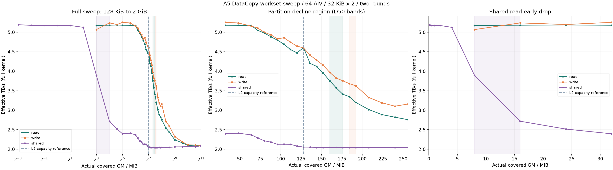

# A5 DataCopy：从高吞吐到低平台的工作集扫描

原来 128 KiB、约 5.108 TB/s 是 64 核同址读；2 GiB、约 2.1 TB/s 是各核独立分区。这两个点改变了地址共享条件，不能直接连成一条大小曲线。本轮将分区读、分区写和同址读分别扫描，固定 64 AIV、uint32 DataCopy(count)、32 KiB × 2、双 UB 窗口完成策略。

2026-10-10，Ascend950DT_9582 / CANN 9.1.0；105 配置 × 两轮、2520 正式样本、420 预热样本。



## 下降发生在哪里

| 曲线 | 高 / 低参考 TB/s | D10 开始下降 | D50 下降一半 | D90 接近低平台 | 最大相邻降幅 | 两轮差异中位数 / 最大 |
| --- | --- | --- | --- | --- | --- | --- |
| 分区读 | 5.180 / 2.098 | 80–96 MiB | 160–176 MiB | 384–512 MiB | 128–136 MiB、8.7% | 0.72% / 7.22% |
| 分区写 | 5.219 / 2.113 | 80–112 MiB | 184–192 MiB | 384–512 MiB | 256–320 MiB、14.2% | 0.91% / 3.43% |
| 同址读 | 2.617 / 2.062 | 16–24 MiB | 48–72 MiB | 112–120 MiB | 8–16 MiB、30.2% | 0.25% / 2.99% |

高参考为预先规定的 8 / 16 / 24 / 32 MiB 带宽中位数；低参考为 512 / 768 / 1024 / 1536 / 2048 MiB。每轮独立取参考值，跨越 D10 / D50 / D90 阈值须连续两个点低于阈值，再取两轮大小区间的并集。两轮都至少下降 20% 才标出下降区间。D50 是高低差下降一半，并非带宽绝对减半。全部点保留，不插值、不拟合预期 S 形。区间为采样分辨率，不是统计置信区间。

## 同址读的高吞吐下降段

同址读在 128 KiB 至 4 MiB 保持约 5.2 TB/s，4→8 MiB 从约 5.126 降至 3.895 TB/s，8→16 MiB 再降至 2.717 TB/s；两个相邻区间分别下降约 24% 与 30%。128 MiB 时已约 2.054 TB/s。统一预定的 8–32 MiB 高参考已经落在这个下降段，所以不能用其约 2.617 TB/s 描述原来的 5 TB/s 高平台。

为对应用户指定的端点，补充描述性分析（未替换预定规则）：以 128 KiB 实测值为高参考、2 GiB 为低参考，两轮 D10 为 4–8 MiB、D50 为 8–16 MiB、D90 为 48–64 MiB。这不是新的独立实验或统计显著性检验。最大相邻陡降定位到 8–16 MiB；区间内没有再采点，不能宣称精确字节阈值。

## 工作集与计时口径

- 分区读写从实际 8 MiB 开始：64 核 × 每核两个 64 KiB 组，分区互不重叠。每个点逻辑搬运 4 GiB，2 GiB 工作集也完整遍历两次。
- 同址读从 128 KiB 开始；每个核完整遍历 ring 至少两次。总 payload = max(4 GiB, 2 × AIV数 × 每核ring) 按组取整。2 GiB 共享工作集对应全核 256 GiB 逻辑 payload，不能用分配大小代替实际触达大小。
- 每条曲线一个进程，按该曲线的最大工作集一次分配 GM，再随机扫描各点；两轮种子不同，跨曲线和轮次重新分配。
- 吞吐 = 实际全核有效 payload / 同 stream ACL Event 完整 kernel 区间，保留调度、初始化、同步、DMA 和结果导出，不扣空循环。核内 SYS_CNT 单独记录，不相加核峰值。
- 每点 2 次预热与 12 次计时；读逐启动校验最后两个 UB 组、保护区及核记录，写校验完整目标与保护区。每条曲线检查 Host / 容器运行前后无其他 NPU 进程；快照不能证明不存在瞬时干扰。首台机器冒烟期间出现其他训练进程，该次计时被拒收，失败原始档案保留。

## 能解释到哪一步

平台配置记录 L2 容量为 128 MiB，图中用竖线标出。下降与容量位置接近只能说明相容性；未测缓存命中率、HBM 物理事务或内存控制器利用率，不能确认因果。所有 TB/s 都是该实现的有效请求吞吐，同址重复读尤其不能等同物理 HBM 带宽。分区不重叠仍可能竞争 bank / 通道 / 缓存资源，本轮没有改变地址映射，不能据此排除或证实。

同址大 ring 的总请求量随大小增加，因此其曲线是“固定实现且完整触达”的结果，未将请求量固定为 4 GiB；分区读写则固定总搬运量。读高低平台和写高低平台各自比较，不混用端点。

## 复现

使用报告附带的固定 planner / runner，配合匹配的 AKL DataCopy 源文件；运行前确认整台 Host 与容器 NPU 都空闲，借用短窗口逐条执行。源码哈希与 binary 哈希绑定在网页点选代码和数据 evidence 中。源码文件内容匹配提交为 a9f21012ffe61afbda405842d3f54d6a5d73aa3a，不表示旧实验曾记录整个仓库提交。

```bash
source /usr/local/Ascend/cann/set_env.sh
cmake -S examples/a5_bandwidth -B build-bandwidth
cmake --build build-bandwidth -j2
mkdir -p tools
cp scripts/prepare_bandwidth.py tools/prepare.py
cp scripts/run_borrowed_batch.py tools/run_borrowed_batch.py
python3 tools/prepare.py --device 1 --clock-hz 1000000000 --clock-source "CANN 9.1 GetSystemCycle: Ascend950PR/950DT SYS_CNT 1 GHz"
# 将本网站 scripts/workset-plan.py 和 workset-runner.py 放到 tools/，保持哈希相同
python3 tools/workset-runner.py --root . --scope read --round 1 --smoke --output results/smoke-read-new
python3 tools/workset-runner.py --root . --scope write --round 1 --smoke --output results/smoke-write-new
python3 tools/workset-runner.py --root . --scope shared --round 1 --smoke --output results/smoke-shared-new
# 每条曲线独立短任务；轮次 1 / 2、scope read / write / shared 各执行一次
python3 tools/workset-runner.py --root . --scope read --round 1 --output results/r1-read-new
```

全部原始归档与完整设备日志留在私有 results。公开数据保留原始 ACL 毫秒、核区间持续 ticks、每核遍历次数、环境摘要和构建/样本/归档绑定的 manifest 哈希；不公开地址、主机名、凭据或绝对设备时钟。

## 实测点（两轮 p50 的中位数）

| 场景 | 实际触达 MiB | 完整 p50 μs | 有效 TB/s | 每核遍历次数 | 全核 payload GiB |
| --- | --- | --- | --- | --- | --- |
| 分区读 | 8 | 829.930 | 5.175 | 512 | 4 |
| 分区读 | 16 | 829.116 | 5.180 | 256 | 4 |
| 分区读 | 24 | 828.103 | 5.187 | 170.667 | 4 |
| 分区读 | 32 | 829.318 | 5.179 | 128 | 4 |
| 分区读 | 48 | 829.557 | 5.177 | 85.3333 | 4 |
| 分区读 | 64 | 830.596 | 5.171 | 64 | 4 |
| 分区读 | 72 | 850.684 | 5.049 | 56.8889 | 4 |
| 分区读 | 80 | 862.733 | 4.978 | 51.2 | 4 |
| 分区读 | 88 | 879.325 | 4.884 | 46.5455 | 4 |
| 分区读 | 96 | 895.345 | 4.797 | 42.6667 | 4 |
| 分区读 | 104 | 914.905 | 4.694 | 39.3846 | 4 |
| 分区读 | 112 | 942.600 | 4.557 | 36.5714 | 4 |
| 分区读 | 120 | 960.498 | 4.472 | 34.1333 | 4 |
| 分区读 | 128 | 932.781 | 4.604 | 32 | 4 |
| 分区读 | 136 | 1021.928 | 4.203 | 30.1176 | 4 |
| 分区读 | 144 | 1041.572 | 4.124 | 28.4444 | 4 |
| 分区读 | 152 | 1086.462 | 3.953 | 26.9474 | 4 |
| 分区读 | 160 | 1142.958 | 3.758 | 25.6 | 4 |
| 分区读 | 168 | 1201.614 | 3.574 | 24.381 | 4 |
| 分区读 | 176 | 1259.163 | 3.411 | 23.2727 | 4 |
| 分区读 | 184 | 1282.720 | 3.348 | 22.2609 | 4 |
| 分区读 | 192 | 1342.137 | 3.200 | 21.3333 | 4 |
| 分区读 | 208 | 1423.932 | 3.016 | 19.6923 | 4 |
| 分区读 | 224 | 1487.271 | 2.888 | 18.2857 | 4 |
| 分区读 | 240 | 1522.786 | 2.820 | 17.0667 | 4 |
| 分区读 | 256 | 1558.224 | 2.756 | 16 | 4 |
| 分区读 | 320 | 1690.026 | 2.541 | 12.8 | 4 |
| 分区读 | 384 | 1762.681 | 2.437 | 10.6667 | 4 |
| 分区读 | 512 | 1917.860 | 2.239 | 8 | 4 |
| 分区读 | 768 | 1985.610 | 2.163 | 5.33333 | 4 |
| 分区读 | 1024 | 2047.295 | 2.098 | 4 | 4 |
| 分区读 | 1536 | 2060.705 | 2.084 | 2.66667 | 4 |
| 分区读 | 2048 | 2048.917 | 2.096 | 2 | 4 |
| 同址读 | 0.125 | 826.904 | 5.194 | 512 | 4 |
| 同址读 | 0.25 | 829.780 | 5.176 | 256 | 4 |
| 同址读 | 0.5 | 829.834 | 5.176 | 128 | 4 |
| 同址读 | 1 | 830.067 | 5.174 | 64 | 4 |
| 同址读 | 2 | 830.319 | 5.173 | 32 | 4 |
| 同址读 | 4 | 837.878 | 5.126 | 16 | 4 |
| 同址读 | 8 | 1102.574 | 3.895 | 8 | 4 |
| 同址读 | 16 | 1580.725 | 2.717 | 4 | 4 |
| 同址读 | 24 | 1706.957 | 2.516 | 2.66667 | 4 |
| 同址读 | 32 | 1793.289 | 2.395 | 2 | 4 |
| 同址读 | 48 | 2672.723 | 2.410 | 2 | 6 |
| 同址读 | 64 | 3628.151 | 2.368 | 2 | 8 |
| 同址读 | 72 | 4224.024 | 2.288 | 2 | 9 |
| 同址读 | 80 | 4847.114 | 2.215 | 2 | 10 |
| 同址读 | 88 | 5414.863 | 2.181 | 2 | 11 |
| 同址读 | 96 | 6059.798 | 2.126 | 2 | 12 |
| 同址读 | 104 | 6562.081 | 2.127 | 2 | 13 |
| 同址读 | 112 | 7077.943 | 2.124 | 2 | 14 |
| 同址读 | 120 | 7742.540 | 2.080 | 2 | 15 |
| 同址读 | 128 | 8364.875 | 2.054 | 2 | 16 |
| 同址读 | 136 | 8888.738 | 2.054 | 2 | 17 |
| 同址读 | 144 | 9468.706 | 2.041 | 2 | 18 |
| 同址读 | 152 | 9982.659 | 2.044 | 2 | 19 |
| 同址读 | 160 | 10497.343 | 2.046 | 2 | 20 |
| 同址读 | 168 | 11023.460 | 2.046 | 2 | 21 |
| 同址读 | 176 | 11559.353 | 2.044 | 2 | 22 |
| 同址读 | 184 | 12095.376 | 2.042 | 2 | 23 |
| 同址读 | 192 | 12630.330 | 2.040 | 2 | 24 |
| 同址读 | 208 | 13665.577 | 2.043 | 2 | 26 |
| 同址读 | 224 | 14702.876 | 2.045 | 2 | 28 |
| 同址读 | 240 | 15781.639 | 2.041 | 2 | 30 |
| 同址读 | 256 | 16792.634 | 2.046 | 2 | 32 |
| 同址读 | 320 | 20985.592 | 2.047 | 2 | 40 |
| 同址读 | 384 | 25187.988 | 2.046 | 2 | 48 |
| 同址读 | 512 | 33367.883 | 2.059 | 2 | 64 |
| 同址读 | 768 | 50028.687 | 2.060 | 2 | 96 |
| 同址读 | 1024 | 66398.506 | 2.070 | 2 | 128 |
| 同址读 | 1536 | 99967.125 | 2.062 | 2 | 192 |
| 同址读 | 2048 | 131742.924 | 2.086 | 2 | 256 |
| 分区写 | 8 | 847.501 | 5.068 | 512 | 4 |
| 分区写 | 16 | 819.830 | 5.239 | 256 | 4 |
| 分区写 | 24 | 826.214 | 5.198 | 170.667 | 4 |
| 分区写 | 32 | 817.584 | 5.253 | 128 | 4 |
| 分区写 | 48 | 820.003 | 5.238 | 85.3333 | 4 |
| 分区写 | 64 | 832.960 | 5.156 | 64 | 4 |
| 分区写 | 72 | 840.952 | 5.107 | 56.8889 | 4 |
| 分区写 | 80 | 859.236 | 4.999 | 51.2 | 4 |
| 分区写 | 88 | 870.500 | 4.934 | 46.5455 | 4 |
| 分区写 | 96 | 889.003 | 4.831 | 42.6667 | 4 |
| 分区写 | 104 | 884.135 | 4.858 | 39.3846 | 4 |
| 分区写 | 112 | 905.187 | 4.745 | 36.5714 | 4 |
| 分区写 | 120 | 924.871 | 4.644 | 34.1333 | 4 |
| 分区写 | 128 | 934.055 | 4.598 | 32 | 4 |
| 分区写 | 136 | 973.189 | 4.413 | 30.1176 | 4 |
| 分区写 | 144 | 1002.833 | 4.283 | 28.4444 | 4 |
| 分区写 | 152 | 1033.120 | 4.157 | 26.9474 | 4 |
| 分区写 | 160 | 1081.390 | 3.972 | 25.6 | 4 |
| 分区写 | 168 | 1122.776 | 3.825 | 24.381 | 4 |
| 分区写 | 176 | 1144.142 | 3.754 | 23.2727 | 4 |
| 分区写 | 184 | 1166.098 | 3.683 | 22.2609 | 4 |
| 分区写 | 192 | 1184.231 | 3.627 | 21.3333 | 4 |
| 分区写 | 208 | 1291.527 | 3.325 | 19.6923 | 4 |
| 分区写 | 224 | 1346.313 | 3.190 | 18.2857 | 4 |
| 分区写 | 240 | 1384.240 | 3.103 | 17.0667 | 4 |
| 分区写 | 256 | 1359.935 | 3.158 | 16 | 4 |
| 分区写 | 320 | 1585.341 | 2.709 | 12.8 | 4 |
| 分区写 | 384 | 1658.765 | 2.589 | 10.6667 | 4 |
| 分区写 | 512 | 1850.771 | 2.321 | 8 | 4 |
| 分区写 | 768 | 1962.384 | 2.189 | 5.33333 | 4 |
| 分区写 | 1024 | 2032.963 | 2.113 | 4 | 4 |
| 分区写 | 1536 | 2039.328 | 2.106 | 2.66667 | 4 |
| 分区写 | 2048 | 2047.251 | 2.098 | 2 | 4 |
