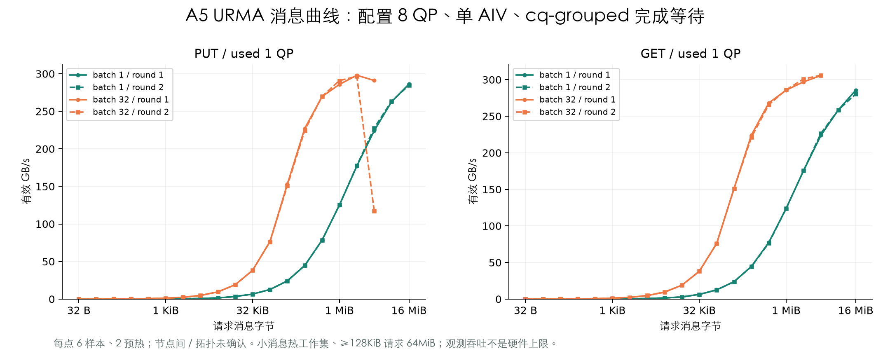
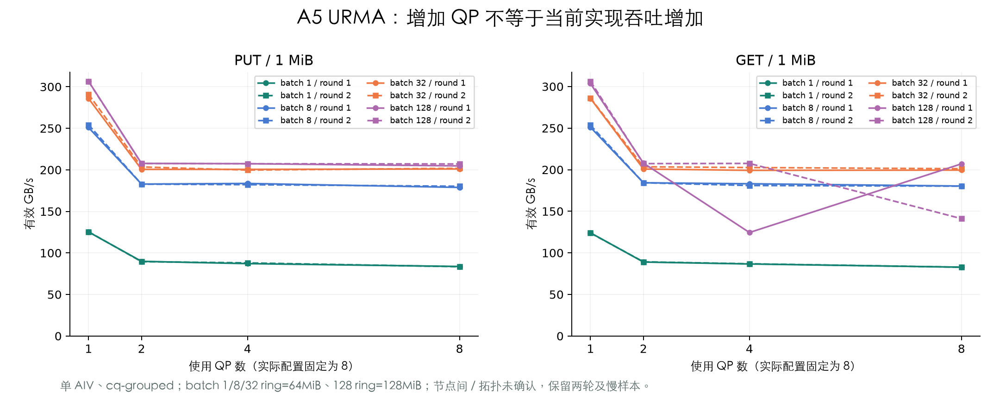

# A5 FullMesh / URMA 通信测量状态

2026-10-09～10（Asia/Shanghai）：A5 / CANN 9.1.0 的单机两 NPU MTE 正式扫描已验收通过：**84 配置 × 2 轮，1008 个计时样本、336 次预热**。每轮使用不同随机顺序 seed，拆成 7 个短任务，每段独立检查整机及容器占用并释放自己的预留。两端完整源、目标和保护区校验、配置覆盖、有效字节、原始计时及完整 SDK 哈希均通过。另保留 8 个冒烟配置的 24 计时样本、8 次预热。

[交互网站](https://kirrito-k423.github.io/micro-benchmark-lab-web/?lab=network) 支持消息、核数、方向、阶段和轮次筛选，分别画出两轮曲线并展开全部原始样本。既有 DataCopy / SIMD 数据未变化。机器占用是采集时快照，不是实时监控。

[核心草稿 PR #52：编译、双端运行与回传命令](https://github.com/Kirrito-k423/ascend-kernel-lab/pull/52)。

## 同机 MTE 观测

消息为 32B～16MiB 共 20 档，包含 PUT/GET 与空对照；另对 16KiB、1MiB、16MiB 扫描 1/2/4/8/16/32/48/64 AIV。固定总消息，各核搬运独立目标分区，每核使用 32KiB UB scratch、完成后复用。48 核分区会按 32B 补齐，筛选按请求量，吞吐按实际补齐后的搬运量计算。

| 请求消息 / 方向 | AIV | 第一轮 GB/s | 第二轮 GB/s |
| --- | ---: | ---: | ---: |
| 1MiB PUT | 1 | 44.84 | 44.83 |
| 1MiB PUT | 2 | 49.66 | 49.59 |
| 1MiB PUT | 64 | 49.43 | 49.13 |
| 1MiB GET | 1 | 18.85 | 18.56 |
| 1MiB GET | 2 | 36.02 | 34.40 |
| 1MiB GET | 4 | 49.81 | 47.21 |
| 1MiB GET | 64 | 49.12 | 47.99 |

该设备对在较大消息下，当前 MTE 实现观察到约 50GB/s 平台：PUT 在 1MiB、2 AIV 已接近该观测平台，GET 在 4 AIV 左右接近。单卡本地 DataCopy GM→UB 与这里的对端 GM→UB→GM 是不同路径，数值不能直接当成同一能力。

80 个非对照配置的跨轮吞吐相对差异中位数为 0.63%；请求消息 ≥128KiB 的差异中位数为 0.79%、最大 7.01%。小消息的波动不能忽略：1KiB PUT 第一轮 0.916GB/s、第二轮 1.778GB/s，差异 94.14%；轮内样本较稳定，跨轮差异原因待查。网站保留两轮及慢样本，不能选择快轮作为理想延迟。

64MiB 是请求工作集，不代表已证明绕过全部缓存；没有物理链路/HBM 流量计数器，也未确认同机设备对的实际链路层级。因此约 50GB/s 是该实现、该设备对与这些条件下的观测平台，不宣称整柜 FullMesh 硬件上限。

## 多机队列与测量口径

两节点 URMA 冒烟已通过：14 配置、42 个计时样本、14 次预热；两端使用完全一致的 binary/完整 SDK 库，并通过完整 oracle 与接收验收。当前只标节点间 / unknown。冒烟 1MiB / batch 32 / 1 QP 观测 PUT 282.19GB/s、GET 284.39GB/s，每组仅 3 个计时样本，不是硬件上限。

正式 URMA 扫描现已验收：**148 配置 × 2 轮，1776 个计时样本、592 次预热**。固定 `--completion cq-grouped --configured-qps 8`，分别使用 1/2/4/8 QP，32B～16MiB 共 20 档消息；每段 8 配置，两端同时提交，每段启动前和结束后检查 Host/容器整机占用，终态后释放自有预留。所有双端完整 oracle、源码/binary/完整 SDK 库、有效字节、时钟与配置覆盖通过。网站现共公开 2850 个通信计时样本，保留既有 DataCopy/SIMD 数据。

本轮所用 SHMEM 构建的运行时映射显示，8 个独立 SQ 对应两个共享 CQ（`0/2/4/6` 与 `1/3/5/7`）。逐 QP quiet 的独立完成计数会误收其他 SQ 的完成；原 GET 第七次启动返回后，QP6/7 共 16MiB 目标仍为初始化值。PR52 新增显式 `cq-grouped` 完成适配，按实际 CQ 汇总，再按 CQE 的 SQ 身份分派；SDK 和全部动态库保持原样，默认 `sdk` 路径保留。未插桩版本先通过原 GET、PUT→GET 混合、SQ/CQ 回绕及实际配置 1/2 QP 的独立 CQ 控制，共 64 次 URMA 回归；另通过 64 次 MTE 回归。回归计时不进入吞吐曲线。

### 正式 URMA 观测

下表均为 1MiB 消息、配置 8 QP、使用 1 QP、单 AIV、`cq-grouped`；吞吐来自发起方 ACL Event，包括完成等待。batch 1/8/32 的实际 ring 为 64MiB，batch128 为 128MiB。

| 方向 | batch | 第一轮 GB/s | 第二轮 GB/s |
| --- | ---: | ---: | ---: |
| PUT | 1 | 125.23 | 125.46 |
| PUT | 8 | 250.89 | 254.24 |
| PUT | 32 | 285.86 | 290.91 |
| PUT | 128 | 306.59 | 306.31 |
| GET | 1 | 124.06 | 123.80 |
| GET | 8 | 250.99 | 253.49 |
| GET | 32 | 285.66 | 286.12 |
| GET | 128 | 303.55 | 306.28 |

在这组条件下，增大完成等待 batch 可提高有效吞吐；1MiB PUT / batch128 两轮约 306.59 / 306.31GB/s，16MiB GET / batch8 两轮约 306.89 / 306.78GB/s。这些是当前实现与设备对的观测值。缓存与物理流量、实际链路及网络独占尚无证据，不能据此认定跨柜或硬件带宽上限。

固定 1MiB / batch32 时，使用 1 QP 的 PUT 约 285.86 / 290.91GB/s；增加到 2 QP 后为 200.54 / 203.50GB/s，4/8 QP 仍约 200GB/s。该结果约束当前单 AIV 提交与共享 CQ 完成适配；提交、等待及实际链路各自的成本仍需分段测量。

146 个非对照配置的跨轮吞吐相对差异（绝对差 / 较小值）中位数为 0.207%，最大 148.59%。个别大消息出现快慢两簇：4MiB PUT / 使用1QP / batch32 两轮为 291.06 / 117.08GB/s，样本中同时出现约 0.89ms 与 2.37ms；16MiB GET / 使用2QP / batch8 为 208.13 / 90.35GB/s。慢样本的设备内循环 tick 也同步增加，波动包含设备测量区间；缓存、完成等待、调度及共享 fabric 原因尚未分段定位。网站保留全部慢样本和两轮，不能用快轮作为保证性能或理想耗时。

URMA 一个提交 AIV 扫描 1/2/4/8 QP 与 1/8/32/128 batch，消息×batch 超过 128MiB ring 的组合不生成。双端同时预约和启动，结束后释放自有预约；机柜映射未确认时只标节点间 / unknown，不称跨柜。

[独立基准源码](https://github.com/Kirrito-k423/ascend-kernel-lab/tree/codex/a5-network-baseline/examples/a5_network) 包含 CMake、NPU kernel、完整双端 oracle、随机顺序 plan、双端 runner 和接收验收。需同一构建的完整 SHMEM 库目录，包括运行时动态加载的 bootstrap 插件，使用 --library-dir 并绑定全部库哈希。

计时用发起方 ACL Event 包围 kernel，包含初始化及完成等待；Host 准备、TCP 协调、下载与验证在区间之外。每次检查两端完整源、目标及前后保护区。双节点分别回传原始结果，按 plan、binary、源文件及样本哈希绑定；缺少一端或 oracle 失败则拒收。不相加两个 rank 的独立峰值。公开文件只含脱敏参数、样本和哈希，原始日志保留私有 results/。

本阶段只测一个设备对，尚未覆盖全柜 bisection、多节点 all-to-all、多流聚合或双向压力；网络独占未有证据，不宣称无竞争硬件上限。
