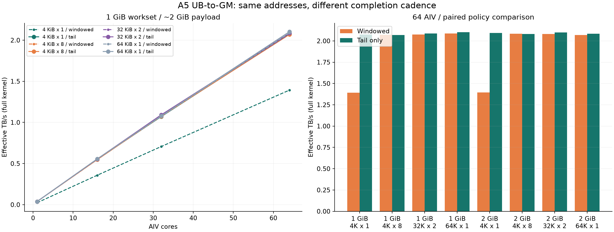

# A5 DataCopy 纯写：双窗口等待与仅末尾完成

循环内等待会限制小提交；放宽显式在途深度后，能否突破原多核纯写曲线，要按同配置逐点比较。源 UB 在循环内保持不变，两种实现共享同一进程的 GM 分配、地址、参数与源 pattern，每对样本随机先后次序。

2026-10-10，Ascend950DT_9582 / CANN 9.1.0，64 个可用 AIV。40 配置 × 两轮，960 正式计时样本、160 预热样本；另有 8 组冒烟、24 计时及 8 预热样本。每次启动校验完整写目标、128 B 保护区与各核记录。



## 同条件对照

下表 p50 为两轮各自 p50 的中位数；GB/s = 实际有效字节 / 该区间。速度比 = 双窗口 p50 / 末尾完成 p50。配对比中位数直接由同轮、同序号的 24 对原始样本计算，两种汇总口径分别标明。所有慢样本保留。

| GM 工作集 | AIV | tile × batch | 双窗口 GB/s | 末尾完成 GB/s | p50 速度比 | 配对比中位数 |
| --- | --- | --- | --- | --- | --- | --- |
| 1 GiB | 1 | 4 KiB × 1 | 23.32 | 38.02 | 1.6301× | 1.6274× |
| 1 GiB | 1 | 4 KiB × 8 | 38.00 | 38.01 | 1.0004× | 1.0002× |
| 1 GiB | 1 | 32 KiB × 2 | 38.02 | 38.02 | 0.9999× | 1.0000× |
| 1 GiB | 1 | 64 KiB × 1 | 37.97 | 37.98 | 1.0002× | 1.0001× |
| 1 GiB | 16 | 4 KiB × 1 | 357.37 | 551.46 | 1.5431× | 1.5423× |
| 1 GiB | 16 | 4 KiB × 8 | 546.87 | 547.28 | 1.0007× | 1.0009× |
| 1 GiB | 16 | 32 KiB × 2 | 551.16 | 554.73 | 1.0065× | 1.0063× |
| 1 GiB | 16 | 64 KiB × 1 | 552.38 | 556.01 | 1.0066× | 1.0057× |
| 1 GiB | 32 | 4 KiB × 1 | 706.76 | 1070.28 | 1.5143× | 1.5148× |
| 1 GiB | 32 | 4 KiB × 8 | 1077.20 | 1073.93 | 0.9970× | 0.9966× |
| 1 GiB | 32 | 32 KiB × 2 | 1085.32 | 1092.43 | 1.0066× | 1.0078× |
| 1 GiB | 32 | 64 KiB × 1 | 1073.01 | 1079.21 | 1.0058× | 1.0063× |
| 1 GiB | 64 | 4 KiB × 1 | 1392.44 | 2075.68 | 1.4907× | 1.4902× |
| 1 GiB | 64 | 4 KiB × 8 | 2072.45 | 2068.50 | 0.9981× | 0.9976× |
| 1 GiB | 64 | 32 KiB × 2 | 2074.90 | 2086.49 | 1.0056× | 1.0044× |
| 1 GiB | 64 | 64 KiB × 1 | 2087.13 | 2102.85 | 1.0075× | 1.0080× |
| 2 GiB | 64 | 4 KiB × 1 | 1395.06 | 2092.71 | 1.5001× | 1.4997× |
| 2 GiB | 64 | 4 KiB × 8 | 2085.09 | 2080.36 | 0.9977× | 0.9989× |
| 2 GiB | 64 | 32 KiB × 2 | 2079.75 | 2100.09 | 1.0098× | 1.0092× |
| 2 GiB | 64 | 64 KiB × 1 | 2069.95 | 2083.34 | 1.0065× | 1.0063× |

## 对约 2 TB/s 的解释

- 1 GiB 工作集，64 AIV：4 KiB × 1 从 1.392 提高到 2.076 TB/s（1.491×）。其余三组的速度变化为 -0.19%～+0.75%。仅末尾完成的最高观测点为 2.103 TB/s。
- 2 GiB 工作集，64 AIV：4 KiB × 1 从 1.395 提高到 2.093 TB/s（1.500×）。其余三组的速度变化为 -0.23%～+0.98%。仅末尾完成的最高观测点为 2.100 TB/s。

这验证了小提交的循环内等待成本。对于已按 32/64 KiB 成组提交的纯写路径，若两种策略吞吐接近，显式窗口等待不足以解释其与 4 TB/s 规格的差距。该实验没有测物理 HBM 事务、内存控制器利用率或 bank 冲突，不能将观测峰值称为硬件上限，也不能据此断定剩余原因。

参考规格来自 [Atlas 950 SuperPoD](https://www.hiascend.com/hardware/cluster?tag=900ai) 的最大 4.0 TB/s 片上内存带宽；本实验是实际 Ascend950DT_9582 上 AIV 纯写有效 payload 口径，未用物理事务计数器核对利用率。

两轮同配置 p50 相对差异（除以两轮平均值）中位数 0.692%，最大 2.692%；这描述重复性，不是置信区间。

## 代码与完成语义

双窗口：每组连续提交 batch 个 DataCopy(count)，设置对应 MTE3_S 事件，复用窗口前 WaitFlag，末尾排空两组。仅末尾完成：删除循环内 SetFlag 和 WaitFlag，最后一次 SetFlag/WaitFlag<MTE3_S>。不能只删 Wait 而反复设置尚未消费的同一事件。该变体只用于 UB→GM 且源 UB 已初始化、循环内不再修改；不适用于需要覆盖 UB 的读取或生产者更新源数据。

两种模式都保留两个 UB 源窗口、地址分区与游标、起止 SyncAll、逐核 SYS_CNT 和记录导出。WindowEvent 是核内管线事件；SyncAll 才同步参与本次 launch 的 AIV。吞吐用同 stream ACL Event 包围完整 kernel，包含初始化、同步和导出；Host 重置、下载与 oracle 在区间外。未扣空循环、未相加单核峰值。

[CANN 9.1 SetFlag/WaitFlag 语义](https://www.hiascend.com/document/detail/en/CANNCommunityEdition/910/API/ascendcopapi/docs/en/api/SIMD-API/basic_api/sync_control/intra_core_sync/SetFlag_WaitFlag_ISASI.md)：MTE3_S 的来源是 MTE3、目的为 Scalar；完成前序 MTE3 访存后置位，Scalar 等待并消费事件。

1 GiB / 2 GiB 工作集为本机平台配置 128 MiB L2 的 8 / 16 倍，实际搬运约 2 GiB / 4 GiB。每组地址按 tile × batch 前进，各核写分区不重叠。持续提交仍受硬件队列回压限制。

## 不重叠地址与 bank / 通道竞争

不同地址仍可能映射到同一内存 bank、控制器、通道或 L2 资源。各 AIV 的 UB 为私有存储；跨核 GM 资源竞争与单核 UB bank 冲突不是同一层问题。本轮未改变地址映射，不能定位 bank 冲突。后续需要固定搬运与提交方式，单独扫描基址偏移、核间步距、分区轮转，并结合对应芯片的映射或性能计数器验证；仅看到地址不同或带宽较低均不足以下结论。

[950 / 架构 3510 的 UB bank 说明](https://www.hiascend.com/document/detail/en/CANNCommunityEdition/910/programug/Ascendcopdevg/docs/en/guide/operator_practice/simd_operator_optimization/memory_access/avoid_ub_bank_conflict/avoid_bank_conflict_npu_arch_3510.md)给出了不同地址落在同一 bank 的例子；这些 Vector / UB 规则不能直接当作 GM 通道映射。

## 复现与证据

[固定源码](https://github.com/Kirrito-k423/ascend-kernel-lab/tree/7870838bc924176c3920e2061b65b9e8a10098dd/examples/a5_store_tail) · [交互曲线、配对样本与逐点源码](https://kirrito-k423.github.io/micro-benchmark-lab-web/?lab=store-tail)

先确认整机 Host 与容器 npu-smi 无其他 NPU 进程。两轮独立顺序，每次只跑一组 case-id；按实际占用插空，输出目录必须新建，原始失败保留。最大核数、UB、L2 由匹配环境查询；SYS_CNT 时钟依据显式提供。源码和二进制哈希、plan、原始毫秒、全输出 oracle、Host/容器占用前后与任务退出/归档哈希由接收器再次验证。占用快照不能证明瞬时干扰或整个 fabric 独占。

```bash
source /usr/local/Ascend/cann/set_env.sh
cmake -S examples/a5_store_tail -B build-store-tail
cmake --build build-store-tail -j2
python3 examples/a5_store_tail/prepare.py --device 1 --clock-hz 1000000000 --clock-source "CANN 9.1 GetSystemCycle: Ascend950PR/950DT SYS_CNT 1 GHz"
python3 examples/a5_store_tail/run.py --round 1 --smoke --warmup 1 --samples 3 --output results/smoke-new
# 根据空闲窗口逐个跑 plan 中的 case-id 0..19，每轮各一次
python3 examples/a5_store_tail/run.py --round 1 --case-id 0 --output results/r1-c00-new
python3 examples/a5_store_tail/run.py --round 2 --case-id 0 --output results/r2-c00-new
```

设备 ELF 已从实测二进制提取。当前工具对该目标指令返回 `<not available>`；因此未以反汇编确认隐式插入的同步或实际指令数，公开结论限于两种显式完成策略的同条件执行结果。

完整原始文件与日志保存在私有 results；公开 JSON 保留原始 ACL 毫秒、各核持续 tick、逐启动 oracle、配对次序与证据哈希。原始设备绝对时间、地址、主机名和日志不公开。
